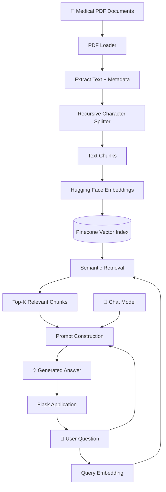
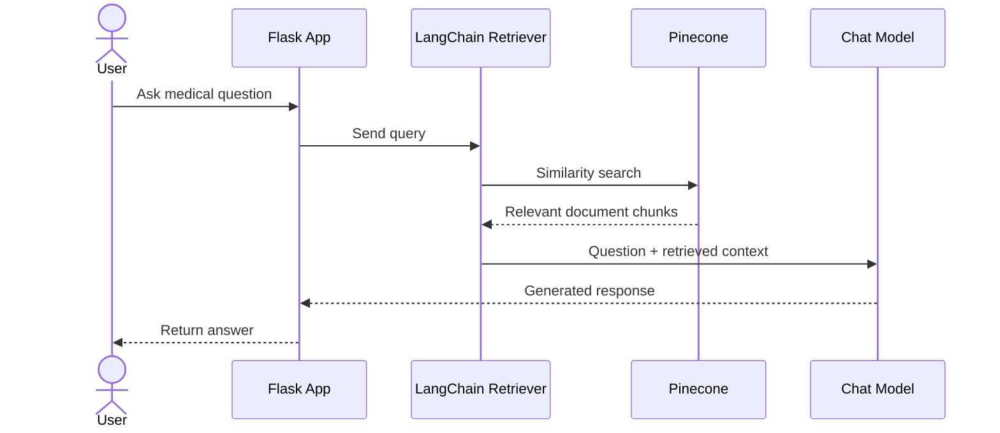
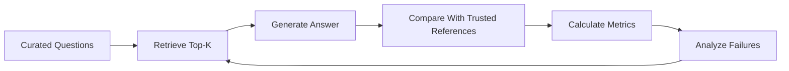
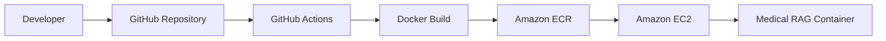

# 🩺 Medical RAG Chatbot

> **Context-aware medical question answering powered by Retrieval-Augmented Generation (RAG).**

<p align="center">
  
  
  
  
  
  
  
</p>

<p align="center">
  <b>Transform medical PDFs into a searchable semantic knowledge base and generate concise answers grounded in retrieved context.</b>
</p>

---

## ⚠️ Medical Safety Disclaimer

> **This project is intended for educational and research purposes only.**
>
> It is **not clinically validated** and must not be used as a substitute for professional medical advice, diagnosis, treatment, or emergency care.
>
> Medical information should always be verified using qualified healthcare professionals and trusted clinical sources.

---

## 📌 Overview

Medical RAG Chatbot is a **document-grounded question-answering system** that combines:

* Medical PDF document ingestion
* Text preprocessing and chunking
* Semantic embeddings
* Vector similarity search
* Retrieval-Augmented Generation
* Large Language Model response generation

Instead of asking an LLM to answer entirely from its internal knowledge, the application first searches a **Pinecone vector database** for relevant passages from the indexed medical documents and then provides those passages to the chat model as context.

This enables a retrieval-first workflow:

```text
Medical PDFs
     ↓
Document Loading
     ↓
Text Chunking
     ↓
Embedding Generation
     ↓
Pinecone Vector Index
     ↓
User Question
     ↓
Semantic Retrieval
     ↓
Relevant Context
     ↓
LLM
     ↓
Grounded Answer
```

The supplied implementation uses `DirectoryLoader` + `PyPDFLoader`, `RecursiveCharacterTextSplitter`, `all-MiniLM-L6-v2`, Pinecone, and a LangChain retrieval chain.

---

# ✨ Features

| Feature               | Technology                        | Purpose                                  |
| --------------------- | --------------------------------- | ---------------------------------------- |
| 📄 PDF ingestion      | `DirectoryLoader` + `PyPDFLoader` | Extract text from medical PDFs           |
| ✂️ Text chunking      | `RecursiveCharacterTextSplitter`  | Break documents into manageable chunks   |
| 🧠 Embeddings         | `all-MiniLM-L6-v2`                | Convert text into semantic vectors       |
| 🗂️ Vector storage    | Pinecone                          | Store and search document embeddings     |
| 🔎 Semantic retrieval | LangChain Retriever               | Retrieve relevant chunks                 |
| 🤖 RAG generation     | LangChain                         | Combine retrieved context with the query |
| 💬 Chat generation    | Configured Chat Model             | Produce the final answer                 |
| 🌐 Application layer  | Flask                             | Serve the application                    |
| 🔐 Configuration      | `python-dotenv`                   | Load credentials securely                |
| ☁️ Deployment         | Docker + AWS                      | Containerized deployment workflow        |

---

# 🏗️ System Architecture



---

# 🔄 RAG Query Lifecycle



### How it works

**1. Ingestion**

Medical PDFs are loaded from the configured data directory.

**2. Preprocessing**

Documents are split into overlapping chunks so that relevant context remains available across chunk boundaries.

**3. Embedding**

Each chunk is converted into a numerical vector using:

```text
sentence-transformers/all-MiniLM-L6-v2
```

The embedding output is **384 dimensions**.

**4. Indexing**

Embeddings are stored in a Pinecone vector index using **cosine similarity**.

**5. Retrieval**

For a new question, the retriever performs semantic similarity search and retrieves the configured top `k` chunks.

**6. Generation**

The retrieved context is passed to the chat model together with the user's question.

**7. Response**

The model generates a concise answer based on the retrieved context.

---

# 🧰 Technology Stack

| Layer                  | Technology                               |
| ---------------------- | ---------------------------------------- |
| Language               | Python 3.12                              |
| Framework              | Flask                                    |
| RAG Framework          | LangChain                                |
| PDF Processing         | PyPDF / LangChain Community              |
| Text Splitting         | LangChain Text Splitters                 |
| Embeddings             | Hugging Face Sentence Transformers       |
| Embedding Model        | `sentence-transformers/all-MiniLM-L6-v2` |
| Vector Database        | Pinecone                                 |
| Vector Integration     | LangChain Pinecone                       |
| RAG Chain              | LangChain Classic                        |
| LLM                    | Configurable Chat Model                  |
| Environment Management | `python-dotenv`                          |
| Containerization       | Docker                                   |
| Cloud                  | AWS                                      |
| CI/CD                  | GitHub Actions                           |

The supplied project notes identify Python, LangChain, Flask, GPT, and Pinecone as the primary stack.

---

# ⚙️ Current Pipeline Configuration

| Parameter        |                                    Value |
| ---------------- | ---------------------------------------: |
| PDF directory    |                                  `data/` |
| PDF pattern      |                                  `*.pdf` |
| Chunk size       |                                    `500` |
| Chunk overlap    |                                     `20` |
| Embedding model  | `sentence-transformers/all-MiniLM-L6-v2` |
| Vector dimension |                                    `384` |
| Pinecone index   |                        `medical-chatbot` |
| Cloud region     |                              `us-east-1` |
| Similarity       |                                   Cosine |
| Retrieval `k`    |                                      `3` |
| Answer length    |                        Up to 3 sentences |

These values are taken from the supplied pipeline configuration.

> **Implementation note:** `DirectoryLoader` with `*.pdf` scans the configured directory but does not recursively traverse nested directories by default. The supplied preprocessing logic also keeps only `source` metadata, so page-level metadata is currently not preserved.

---

# 📁 Recommended Project Structure

```text
medical-chatbot/
│
├── data/
│   ├── medical_reference_1.pdf
│ 
│
├── notebooks/
│   └── medical_rag.ipynb
│
├── src/
│   ├── __init__.py
│   ├── prompt.py
│   ├── helper.py
|
├── templates/
│   ├── chat.html
|
├── static/
│   ├── style.css
│     
├── app.py
├── store_index.py
├── requirements.txt
├── .env
├── ENV.txt
├── .gitignore
├── Dockerfile
└── README.md
```

> The structure above is a recommended evolution of the supplied notebook-based workflow rather than a claim about the repository's exact current structure.

---

# 🚀 Getting Started

## Prerequisites

Make sure the following are installed:

* Python 3.12
* Conda
* Git
* Pinecone account
* Pinecone API key
* API key for the configured LLM provider
* Medical PDF files you are authorized to process

---


## Note :
```
The device is UBUNTU 26.04 so all the installation commands are Linux Based.

```
-----

## 1. Clone the repository

```bash
git clone git@github.com:adidongre006/medical-rag-chatbot.git
cd medical-chatbot
```


---

## 2. Create the Conda environment

The supplied project instructions use a Conda environment named `medibot` with Python 3.12.

```bash
conda create -n medibot python=3.12 -y
conda activate medibot
```

---

## 3. Install dependencies

```bash
pip install -r requirements.txt
```

The project uses packages including:

```text
langchain-community
langchain-text-splitters
langchain-huggingface
langchain-pinecone
langchain-classic
pinecone
sentence-transformers
python-dotenv
pypdf
```

Pin tested dependency versions before using the project for reproducible deployment.

---

# 🔐 Environment Configuration

Create a `.env` file in the project root:

```env
PINECONE_API_KEY=your_pinecone_api_key
OPENAI_API_KEY=your_openai_api_key
```

The supplied project configuration uses these two variables. `OPENAI_API_KEY` should only be used when the configured chat model is OpenAI-based.

### `.gitignore`

Never commit credentials.

```gitignore
.env
.env.*
!.env.example

__pycache__/
*.py[cod]
.venv/
venv/
.ipynb_checkpoints/
```

---

# 📄 Add Medical Documents

Place your PDF files inside:

```text
data/
```

Example:

```text
data/
├── medical_book.pdf

```

Only use documents that you are legally and ethically authorized to process.

---

# 🧠 Running the RAG Pipeline

## Step 1 — Build / store embeddings

Run:

```bash
python3 store_index.py
```

The supplied workflow uses this script to store embeddings in Pinecone.

---

## Step 2 — Start the Flask application

```bash
python3 app.py
```

Then open the local application URL exposed by Flask.

---

# 🔬 Core RAG Implementation

### Load PDF files

```python
from langchain_community.document_loaders import (
    DirectoryLoader,
    PyPDFLoader,
)

def load_pdf_files(data: str):
    loader = DirectoryLoader(
        data,
        glob="*.pdf",
        loader_cls=PyPDFLoader,
    )
    return loader.load()

extracted_data = load_pdf_files("data")
```

### Split documents

```python
from langchain_text_splitters import RecursiveCharacterTextSplitter

def text_split(documents):
    splitter = RecursiveCharacterTextSplitter(
        chunk_size=500,
        chunk_overlap=20,
    )
    return splitter.split_documents(documents)

texts_chunk = text_split(extracted_data)
```

### Create embeddings

```python
from langchain_huggingface import HuggingFaceEmbeddings

embedding = HuggingFaceEmbeddings(
    model_name="sentence-transformers/all-MiniLM-L6-v2"
)
```

### Connect to Pinecone

```python
from langchain_pinecone import PineconeVectorStore

docsearch = PineconeVectorStore.from_existing_index(
    index_name="medical-chatbot",
    embedding=embedding,
)

retriever = docsearch.as_retriever(
    search_type="similarity",
    search_kwargs={"k": 3},
)
```

### Create the RAG chain

```python
from langchain_classic.chains import create_retrieval_chain
from langchain_classic.chains.combine_documents import (
    create_stuff_documents_chain,
)
from langchain_core.prompts import ChatPromptTemplate

system_prompt = (
    "You are a medical assistant for question-answering tasks. "
    "Use the retrieved context to answer the question. "
    "If the context does not contain the answer, say you do not know. "
    "Keep the answer concise and use no more than three sentences.\n\n"
    "{context}"
)

prompt = ChatPromptTemplate.from_messages([
    ("system", system_prompt),
    ("human", "{input}"),
])

question_answer_chain = create_stuff_documents_chain(
    chatModel,
    prompt,
)

rag_chain = create_retrieval_chain(
    retriever,
    question_answer_chain,
)
```

The supplied implementation explicitly instructs the model to use retrieved context and say it does not know when the context is insufficient.

---

# 💬 Example Query

```python
response = rag_chain.invoke({
    "input": "What is Acromegaly and gigantism?"
})

print(response["answer"])
```

### Inspect retrieved evidence

```python
for document in response["context"]:
    print("Source:", document.metadata.get("source"))
    print(document.page_content)
    print("-" * 50)
```

This is useful when debugging retrieval quality and verifying that generated answers are actually supported by the indexed documents.

---

# 🧪 Example Questions

### General medicine

```text
What is Acromegaly and gigantism?
```

### Dermatology

```text
What is Acne?
```

### Treatment

```text
What is the treatment of Acne?
```

These prompts come from the supplied project workflow and are examples rather than benchmark tests.

---

# 📊 Evaluation Strategy

A medical RAG system should be evaluated using a **fixed, curated question set** before its answers are trusted.

Recommended metrics:

| Metric             | Purpose                                                     |
| ------------------ | ----------------------------------------------------------- |
| Recall@K           | Measures whether relevant evidence is retrieved             |
| Precision@K        | Measures retrieval noise                                    |
| Faithfulness       | Measures whether claims are supported by retrieved evidence |
| Answer Relevance   | Measures whether the response answers the question          |
| Citation Accuracy  | Measures whether the source supports the claim              |
| Abstention Quality | Measures safe handling of unsupported questions             |
| Latency            | Measures end-to-end response speed                          |

The supplied notes intentionally do not claim an accuracy score because no measured benchmark dataset was provided.

### Evaluation workflow



---


### Page-level citations

The current metadata filtering keeps `source`, but page-level metadata is not preserved. Preserve page numbers if you want responses to provide document/page citations.

### Duplicate ingestion

Repeatedly inserting the same chunks can create duplicate vectors. A production implementation should use stable IDs and an explicit update/versioning strategy.

---

# ☁️ AWS CI/CD Deployment

The supplied deployment notes describe an architecture using:

```text
GitHub
   ↓
GitHub Actions
   ↓
Docker Image
   ↓
Amazon ECR
   ↓
Amazon EC2
   ↓
Running Container
```

## Deployment architecture



## Deployment steps

### 1. AWS setup

Create the required AWS resources:

* IAM identity / deployment permissions
* Amazon ECR repository
* Ubuntu EC2 instance

### 2. Install Docker on EC2

The supplied notes use:

```bash
sudo apt-get update -y
sudo apt-get upgrade

curl -fsSL https://get.docker.com -o get-docker.sh
sudo sh get-docker.sh

sudo usermod -aG docker ubuntu
newgrp docker
```

### 3. Configure GitHub Actions runner

The source deployment workflow describes configuring the EC2 machine as a **self-hosted GitHub Actions runner**.

### 4. Configure GitHub Secrets

The supplied workflow expects secrets such as:

```text
AWS_ACCESS_KEY_ID
AWS_SECRET_ACCESS_KEY
AWS_DEFAULT_REGION
ECR_REPO
PINECONE_API_KEY
OPENAI_API_KEY
```

> **Security recommendation:** do not copy account IDs, access keys, or other environment-specific credentials into the README. Use GitHub Secrets and least-privilege IAM policies.

---

# 🔒 Security

### API credentials

Store secrets in environment variables or managed secret stores.

Never:

```text
❌ Commit API keys
❌ Hard-code credentials
❌ Put secrets inside Docker images
❌ Publish `.env`
```

Prefer:

```text
✅ Environment variables
✅ GitHub Secrets
✅ AWS IAM
✅ Secret managers
✅ Least-privilege permissions
```

### Medical data

Do not upload or index confidential patient information unless the system has been specifically designed, secured, and approved for that data.

---

# 🤝 Contributing

Contributions are welcome.

```bash
# Fork the repository

# Create a feature branch
git checkout -b feature/your-feature

# Make your changes

# Commit
git add .
git commit -m "feat: improve retrieval pipeline"

# Push
git push origin feature/your-feature
```

Then open a Pull Request describing:

* What changed
* Why it changed
* How it was tested
* Any limitations or follow-up work

---

# 📄 License

Add a `LICENSE` file containing the license you intend to use.

Until a license is explicitly added, no open-source license should be assumed.

---

# 👨‍💻 Project

**Medical RAG Chatbot**

Built with:

**Python · LangChain · Hugging Face · Pinecone · Flask · AWS**

---

<p align="center">
  <b>Retrieve → Ground → Generate</b>
  <br/>
  <sub>Educational and research project — not intended for clinical decision-making.</sub>
</p>
